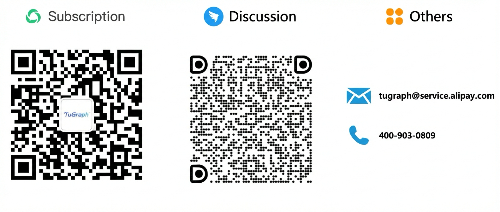

# TuGraph Community

> 🌐️ English | [中文](docs/README-cn.md)

**Welcome to the TuGraph community !**

This is the starting point for becoming a contributor - improving code and docs, giving talks, etc.

## Introduction
TuGraph community is an open-source graph technology community, covering foundational technologies 
such as Graph Database, Graph Computing Engine, and Graph Learning. It also includes application 
technologies that combine LLMs, such as Text2GQL, GraphRAG, Graph Agents, and Graph Visualization. 
We aim to create a full-stack graph computing technology to help individual developers, 
commercial companies, and open-source communities solve various issues related to the 
storage, computation, querying, analysis, and application of graph data.

## Architecture

  

- [Roles](docs/ROLES.md): Describes the roles individuals can assume within the TuGraph community.
- [SIGs](docs/SIGS.md): To enhance community transparency and collaboration among community members, 
TuGraph created a series of Special Interest Groups (SIGs).

Visit [tugraph.tech](https://tugraph.tech) for more information about using TuGraph.

## Author
TuGraph is a collection of open-source graph computing projects initiated by Ant Group's 
Graph Computing Team, with an active development community.

## Contributing
You can reference [Contributing](docs/CONTRIBUTING.md) document and submit GitHub Issues/PRs 
to provide feedback and suggest improvements for TuGraph.

## Contact
You can contact with us directly through TuGraph Discord and DingTalk provided below.

- Discord: https://discord.gg/KBCFbNFj

## Meeting

> We are preparing the agenda for the community meeting.

